# Offre de service – Refonte du site du Parc des Expositions d'Abidjan

Oct 1, 2026 · @Social Media

Nous proposons de refondre le site du Parc des Expositions d'Abidjan en 6 semaines, en conservant l'outil de gestion actuel. La page d'accueil, le formulaire de devis et la version anglaise seront en ligne dès la fin de la semaine 4. Le site complet suivra fin de semaine 6.

## Contexte et compréhension du besoin

Le site actuel ([parcdesexpositionsabidjan.com](https://www.parcdesexpositionsabidjan.com/fr)) présente les espaces, mais il ne répond pas à la question centrale du cahier des charges : « Pourquoi organiser mon événement au Parc des Expositions ? ».

Le site doit devenir un outil commercial. Il doit :

- générer des demandes de devis ;
- porter l'image haut de gamme et internationale du Parc ;
- ressortir dans Google quand un organisateur cherche un lieu pour un salon, un congrès ou un événement d'entreprise à Abidjan ou en Afrique de l'Ouest.

Nos engagements :

- **Pas de reconstruction.** Le site reste sur Drupal, l'outil que vos équipes utilisent déjà. Seule l'apparence change : vos habitudes de mise à jour sont conservées.
- **Deux langues.** Le français et l'anglais au même niveau ; la version anglaise existe déjà et sera fiabilisée.
- **Les priorités d'abord.** Page d'accueil, formulaire de devis, visibilité dans Google, boutons « Demander un devis » et version anglaise.

Une maquette du site complet est déjà prête, en français et en anglais : **[pae-orpin.vercel.app](https://pae-orpin.vercel.app/)**. Elle est présentée en détail, avec des captures d'écran, dans la section [La maquette](#la-maquette).

## Ce que nous avons constaté

Le site actuel est techniquement solide, mais presque invisible dans Google. Sur une recherche comme « salle événementielle Abidjan centre de conférence », les premiers résultats sont la presse, GL events et des annuaires, pas le site du Parc. Constats relevés le 1er octobre 2026 :

| Constat | Importance | Ce que nous proposons |
| --- | --- | --- |
| Le titre de la page d'accueil dans Google (« Page d'accueil \| Parc des Expositions d'Abidjan ») ne dit pas ce que propose le Parc | Forte | Un titre qui reprend les mots recherchés : convention center, salons, Abidjan, Côte d'Ivoire |
| Aucun texte de présentation sous le lien dans Google | Forte | Un court texte d'accroche pour chaque page, en français et en anglais |
| Le grand titre de l'accueil (« Bienvenue au Parc des Expositions d'Abidjan ») ne parle pas d'événements | Forte | Un titre qui dit le métier du Parc : salons, congrès, événements |
| Les chiffres clés apparaissent comme « 0 m² » et « 0 places » pour Google | Forte | Les vrais chiffres visibles par tous, l'animation en plus |
| Peu de contenu : les 3 espaces partagent une seule page | Forte | Une page par espace, par type d'événement et par service |
| Services, photothèque et devis absents du menu | Forte | Un menu en 6 rubriques, conforme au cahier des charges, et un bouton « Demander un devis » sur chaque page |
| Images sans description (le logo s'appelle « Imported image ») | Moyenne | Une description pour chaque image, utile pour Google et pour l'accessibilité |
| Plan du Parc disponible seulement en PDF | Moyenne | Des fiches techniques lisibles en ligne, en plus du PDF à télécharger |
| Liens partagés sur les réseaux sociaux sans image ni description | Moyenne | Un visuel et un texte prévus pour chaque partage |
| Google ne sait pas que le Parc est un lieu d'événements | Moyenne | Des informations lisibles par Google (lieu, événements, questions fréquentes) pour des résultats plus riches |
| Le site de GL events ressort avant celui du Parc sur son propre nom | Moyenne | Coordination avec GL events : lien vers le site du Parc et contenus cohérents |

D'autres points seront vérifiés une fois les accès obtenus : pages connues de Google, vitesse sur mobile, fiche Google Business, sites qui renvoient vers le Parc.

Pour aller plus loin :

- **Des pages pour chaque type de recherche** : « Salon professionnel Abidjan », « Congrès Abidjan », « Événement d'entreprise », « Concert », et leurs équivalents en anglais pour les organisateurs internationaux.
- **Un agenda qui attire du monde** : une page par événement, qui ramène régulièrement de nouveaux visiteurs.
- **Venir à Abidjan** : accès, hôtels, visas, pour les organisateurs et participants venus de l'étranger.
- **Des liens depuis les partenaires** : chambres de commerce, ministères, offices du tourisme, organisateurs accueillis (SARA, MIVA, Archibat).
- **Des résultats mesurés** : nombre de demandes de devis, d'appels et de messages WhatsApp générés par le site.

## Les sites qui nous inspirent

Ces quatre références partagent trois choix que nous reprenons : l'image avant le texte, un accès direct aux espaces selon leur capacité, et un bouton « Demander un devis » toujours visible.

| Site | Ce que nous retenons pour le Parc |
| --- | --- |
| [GL events](https://www.gl-events.com/fr) | Cohérence avec le groupe exploitant ; des fiches lieux claires (capacités, plans) |
| [The Seed](https://www.theseed.com.tr/en/home-page/) | Notre référence principale : pages épurées, grandes photos, capacités selon la configuration, devis sur chaque page |
| [Hungexpo](https://hungexpo.hu/) | Un parc d'expositions comparable : halls, agenda des salons, location d'espaces |
| [Metropolitan Santiago](https://metropolitansantiago.cl/en/) | Recherche d'un espace par type et capacité ; version anglaise aussi complète que l'originale |

Dans la maquette, cela donne :

- un diaporama de grandes photos en ouverture ;
- les rubriques du cahier des charges dès l'accueil ;
- une page par espace sur le modèle de The Seed ;
- un comparatif des 3 espaces ;
- un formulaire de devis complet ;
- le numéro WhatsApp toujours visible en haut de page.

## Notre proposition

### Organisation du site

1. Qui sommes-nous ? (le Parc, GL events, engagements, chiffres clés)
2. Nos espaces : Dôme, Hall, Parvis & esplanades, visite virtuelle, comparatif des capacités, fiches techniques
3. Nos services : audiovisuel, restauration, mobilier, sécurité, nettoyage, hébergement
4. Photothèque (photos, vidéos, kit presse)
5. Agenda (une page par événement)
6. Contact / Réserver / Demander un service (devis, accès, questions fréquentes)

S'y ajoutent des pages dédiées à chaque type d'événement et une page « Venir à Abidjan ».

### Design

Le design s'inspire de The Seed et de l'architecture du Parc :

- fond blanc et grandes photos ;
- l'arche du logo reprise en motif ;
- les titres dans la police du logo (Poppins) ;
- une palette tirée du logo : l'orange du Parc, un noir profond et un blanc chaud.

Les éléments de design sont livrés sous forme de blocs réutilisables : l'équipe du Parc pourra créer de nouvelles pages sans faire appel à un développeur.

### Ce qui se passe en coulisses

- **Le site garde son outil de gestion.** Pas de reconstruction, seulement des briques standard et éprouvées, donc un site simple à maintenir.
- **Un formulaire de devis qui arrive au bon endroit.** Les demandes sont envoyées directement au service commercial, avec un export possible et une protection contre les faux messages.
- **Un site rapide, même sur mobile.** Les images sont allégées et se chargent au fur et à mesure.
- **La visite virtuelle 360°.** Elle est intégrée au site si le Parc en dispose.

### Visibilité dans Google

- Une page dédiée à chaque grande famille de recherches. Le cahier des charges cite 18 mots-clés.
- Les anciennes adresses du site sont redirigées vers les nouvelles : aucun visiteur ni aucune position dans Google n'est perdu.
- La version anglaise est correctement signalée à Google.
- Les positions sont suivies chaque mois pendant 3 mois après la mise en ligne.

## La maquette

La maquette est en ligne : **[pae-orpin.vercel.app](https://pae-orpin.vercel.app/)**, version anglaise sur [/en/](https://pae-orpin.vercel.app/en/).

Elle couvre toutes les rubriques proposées, en français et en anglais, avec les textes, photos et événements réels du Parc. C'est une démonstration : le formulaire n'envoie pas encore de vraies demandes. Elle servira de modèle pour le site final.

| Rubrique | Pages |
| --- | --- |
| Accueil | [Accueil](https://pae-orpin.vercel.app/) |
| Qui sommes-nous ? | [Le Parc, GL events, la destination Abidjan](https://pae-orpin.vercel.app/qui-sommes-nous.html) |
| Nos espaces | [Vue d'ensemble et comparatif](https://pae-orpin.vercel.app/nos-espaces.html), [Hall d'exposition](https://pae-orpin.vercel.app/hall-exposition.html), [Le Dôme](https://pae-orpin.vercel.app/le-dome.html), [Parvis & esplanades](https://pae-orpin.vercel.app/parvis-esplanades.html), [Visite virtuelle 360°](https://pae-orpin.vercel.app/visite-virtuelle.html) |
| Nos services | [Services](https://pae-orpin.vercel.app/nos-services.html) |
| Photothèque | [Photothèque](https://pae-orpin.vercel.app/phototheque.html) |
| Agenda | [Frise des événements](https://pae-orpin.vercel.app/agenda.html), [Fiche événement](https://pae-orpin.vercel.app/fiche-evenement.html) |
| Contact / devis | [Formulaire de devis, accès, carte](https://pae-orpin.vercel.app/contact-devis.html) |
| Pied de page | [Informations légales et cookies](https://pae-orpin.vercel.app/informations-legales.html) |

Ce que la maquette montre :

- **Une réponse claire à « Pourquoi le Parc des Expositions ? »** dès l'accueil. On y trouve de grandes photos, puis les chiffres clés, enfin visibles par Google. Suivent l'accès aux trois espaces, l'agenda, les actualités Facebook, Instagram et LinkedIn, les organisateurs qui ont fait confiance au Parc et un bouton « Demander un devis ».
- **Une page par espace.** Chacune présente les chiffres clés, des photos, une présentation, les équipements, les services associés, les documents à télécharger et une demande de devis où l'espace est déjà choisi. La page « Nos espaces » compare les trois.
- **Un agenda en frise chronologique.** Il reprend les 20 événements à venir, relevés sur le site actuel. On peut les trier par type et ouvrir le détail de chacun, avec le lien de réservation et l'ajout à son agenda.
- **Un formulaire de devis complet.** Les erreurs de saisie sont signalées, et un récapitulatif de la demande s'affiche à l'envoi. Le numéro du Parc ouvre WhatsApp en un clic, sur toutes les pages.
- **La visite virtuelle 360° intégrée.**
- **Un site accessible à tous.** Les textes sont bien lisibles (contrastes conformes aux normes d'accessibilité) et le site se parcourt aussi au clavier. Il a été vérifié sur mobile, tablette et ordinateur, en français et en anglais.
- **Un site conforme et rapide.** Un bandeau cookies demande l'accord des visiteurs avant d'afficher Google Maps, Facebook ou la visite virtuelle. Les photos sont allégées et s'affichent au fur et à mesure, ce qui garde les pages rapides, même en 4G.

### Captures d'écran

**Accueil sur ordinateur.** Les grandes photos ouvrent la page ; le bouton « Demander un devis » reste toujours visible.

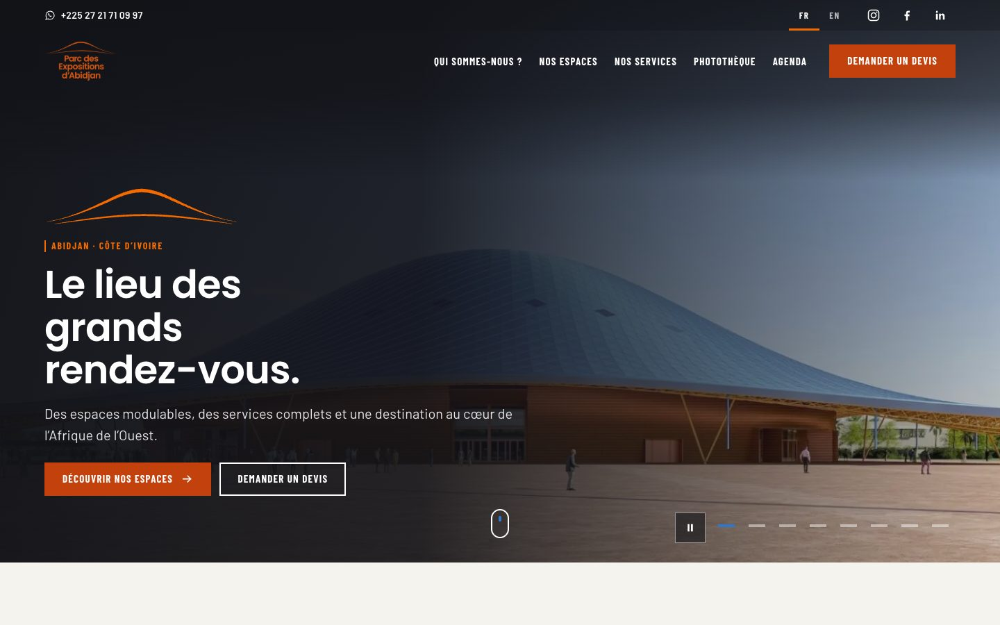

**Accueil, page complète.**

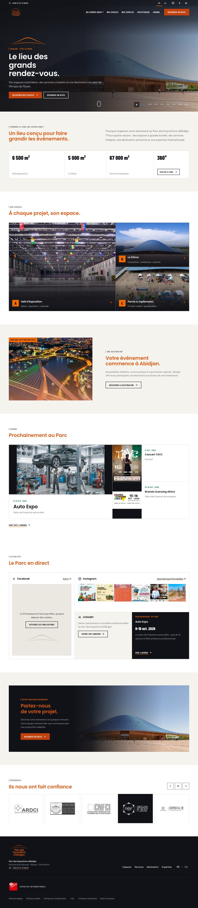

**Version anglaise et accueil sur mobile.**

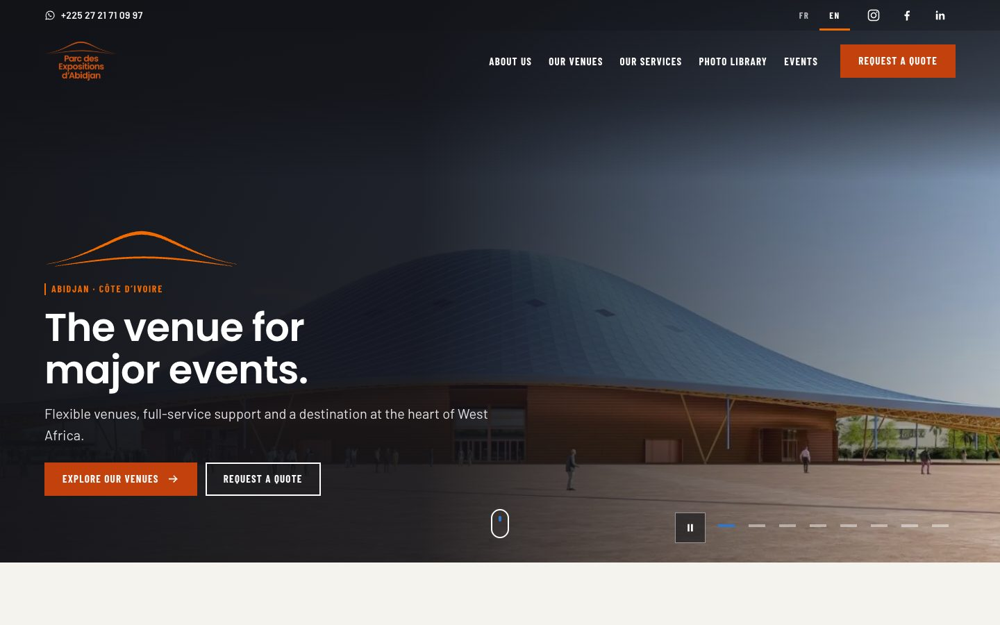

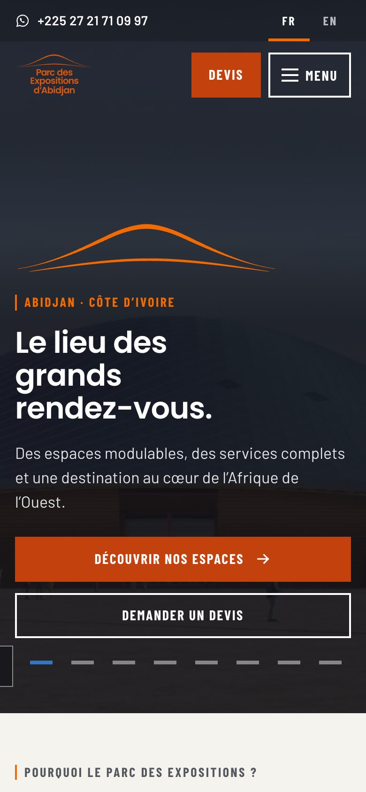

**Nos espaces.** Chaque espace mène à sa page dédiée ; un comparatif des trois espaces suit en dessous.

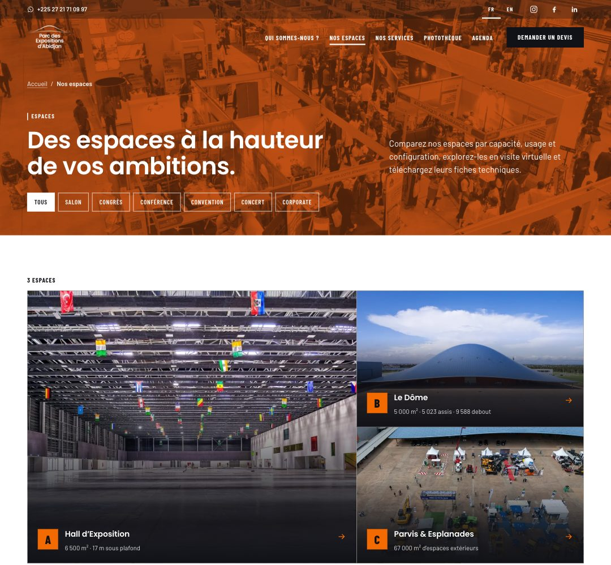

**Page espace : Le Dôme.** Chiffres clés, photos, présentation et demande de devis avec l'espace déjà choisi.

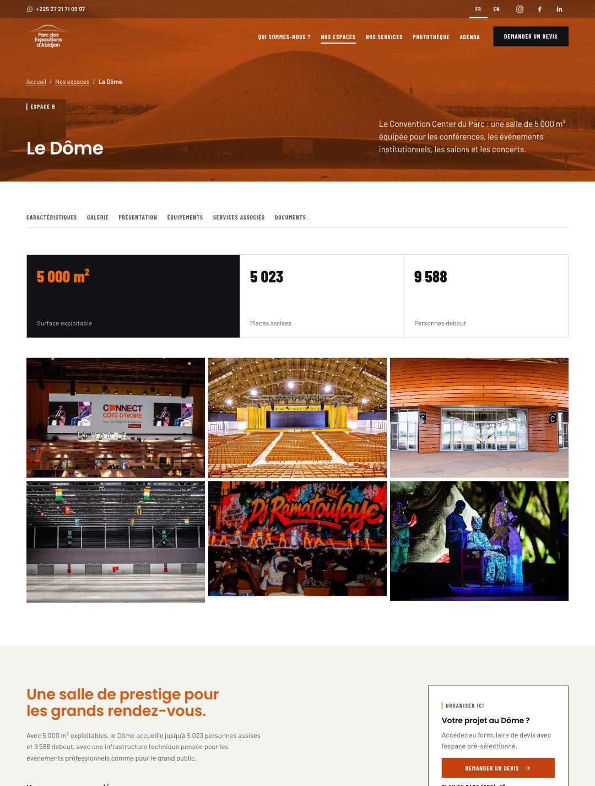

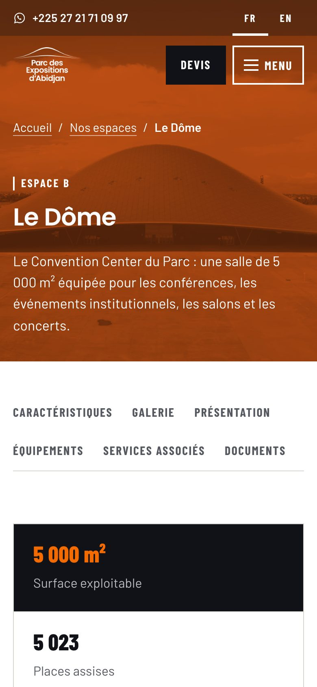

**Nos services.**

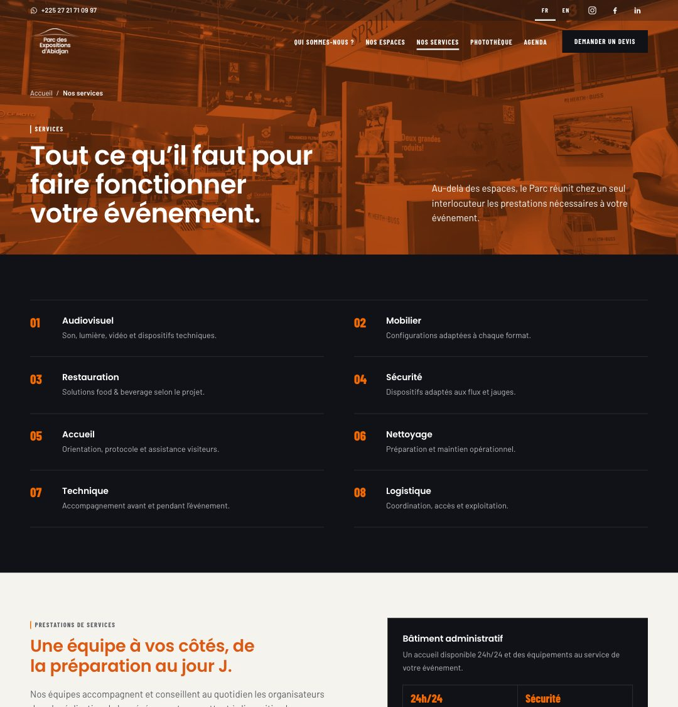

**Agenda.** Les événements à venir, triables par type.

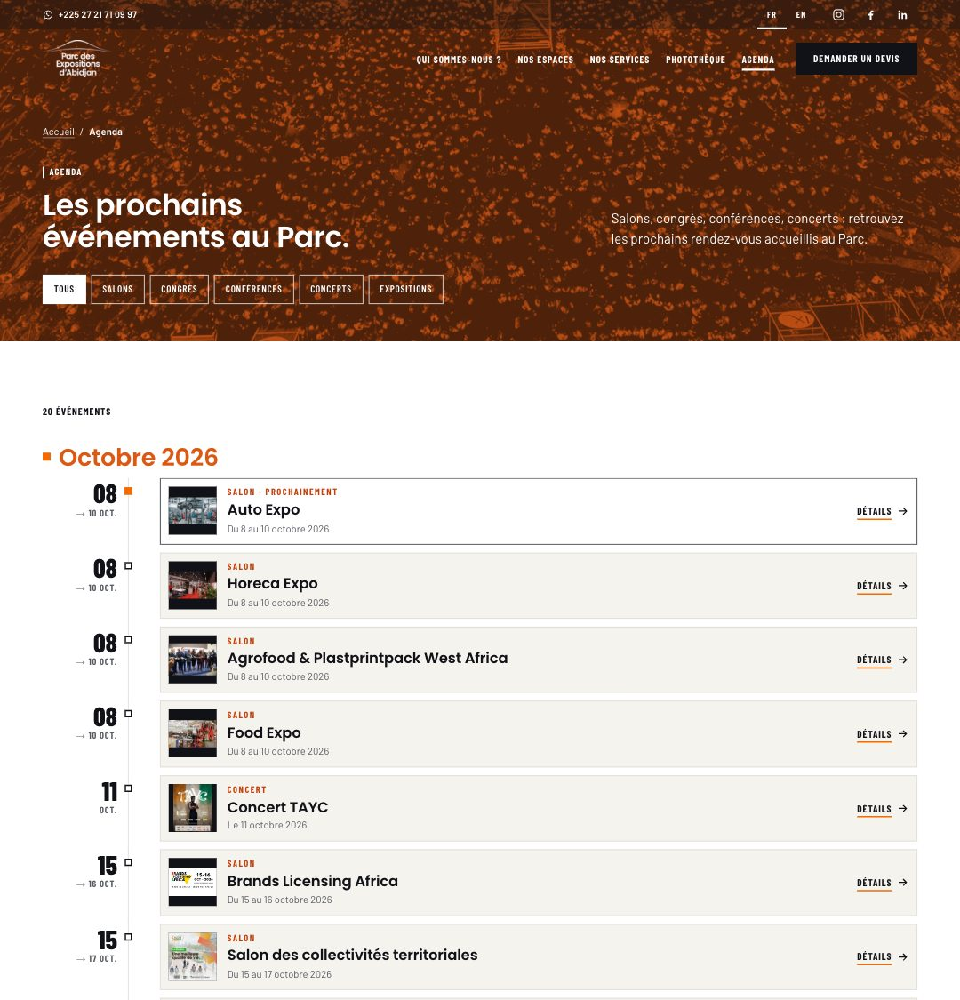

**Photothèque.** Les photos se trient par espace et par type d'événement.

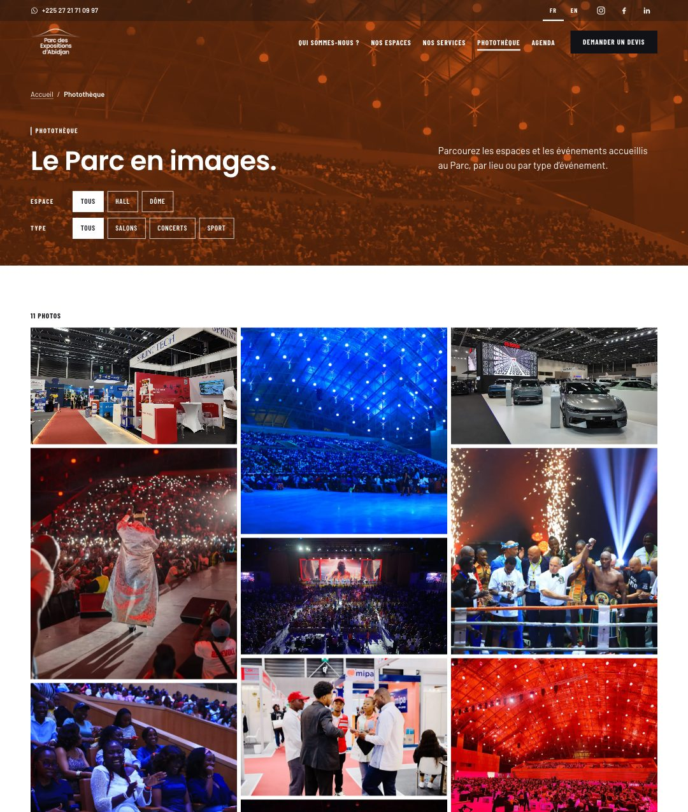

**Contact et devis.** Le formulaire de devis, avec à côté les coordonnées du Parc et la photo du totem d'accueil.

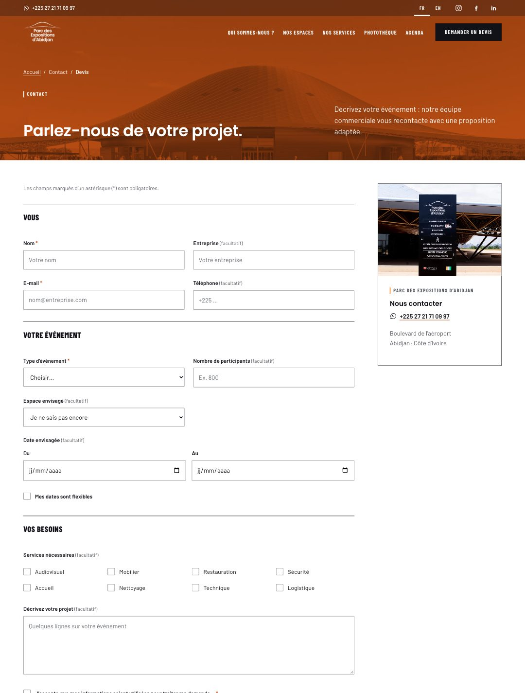

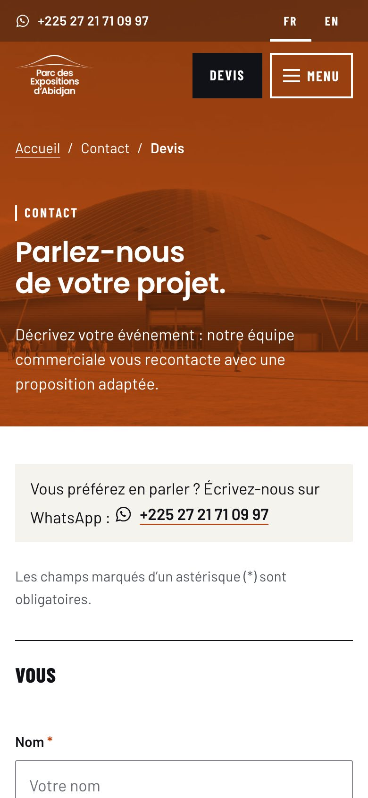

**Visite virtuelle 360°.**

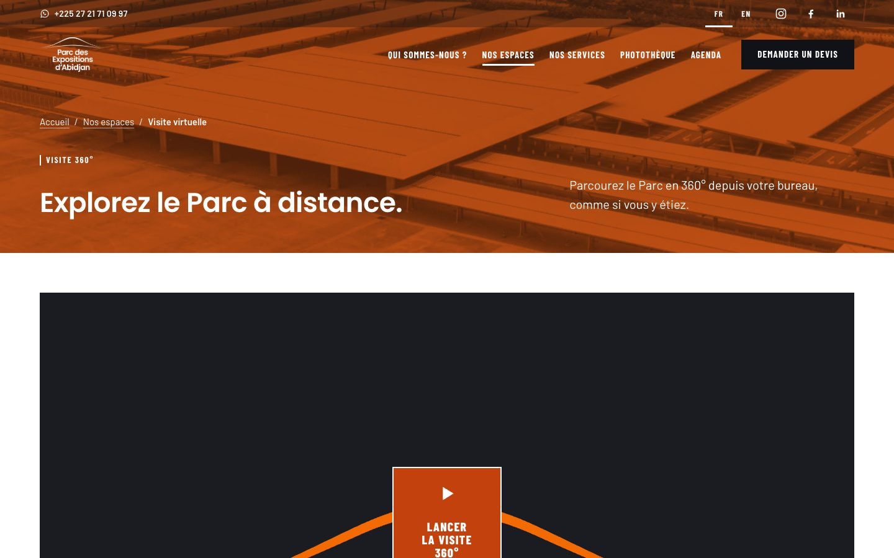

## Ce que vous recevez, étape par étape

| Étape | Semaines | Ce que vous recevez | Ce que vous validez |
| --- | --- | --- | --- |
| 1. Audit express | S1 (3 jours) | Bilan du site actuel (facilité d'usage, technique, visibilité dans Google, contenus) et liste des mots-clés à viser | Note d'audit |
| 2. Design | S1 à S2 | Maquette de toutes les rubriques (déjà prête, en français et en anglais), ajustée selon vos retours ; pages par type d'événement ; guide de style | Maquettes finales |
| 3. Construction et contenus | S2 à S5 | Nouveau design installé sur le site, formulaire de devis, contenus en français et en anglais, fiches techniques | Validation sur un site de test |
| 4. Tests | S4 (priorités), S5 (site complet) | Vérifications sur mobile, tablette et ordinateur, formulaires, visibilité dans Google, vitesse | Procès-verbal de validation |
| 5. Mise en ligne | S6 | Mise en ligne, redirection des anciennes adresses, sauvegarde, formation de votre équipe | Procès-verbal de mise en ligne |

Après la mise en ligne : 3 mois de suivi, avec un rapport mensuel sur la visibilité dans Google et les demandes de devis reçues.

## Planning

| Étape | S1 | S2 | S3 | S4 | S5 | S6 |
| --- | --- | --- | --- | --- | --- | --- |
| 1. Audit express | ■ |  |  |  |  |  |
| 2. Design | ■ | ■ |  |  |  |  |
| 3. Construction et contenus |  | ■ | ■ | ■ | ■ |  |
| 4. Tests |  |  |  | ■ Priorités | ■ Site complet |  |
| 5. Mise en ligne |  |  |  | ◆ Priorités en ligne |  | ◆ Site complet en ligne |

Les priorités sont en ligne fin S4, le site complet fin S6, puis viennent 3 mois de suivi. Pour tenir 6 semaines :

- **Une équipe dédiée** : 2 personnes à plein temps (un développeur et un designer spécialiste du référencement), qui travaillent en parallèle dès la semaine 2.
- **Pas de reconstruction** : nous habillons le site existant avec des briques standard.
- **Un périmètre maîtrisé** : 6 pages par type d'événement au lancement, les autres ensuite ; visite 360° par lien externe ; photothèque construite à partir des médias déjà en ligne.
- **Côté Parc** : un interlocuteur unique pour les décisions, des validations sous 48 h, et les textes et traductions anglaises livrés au plus tard fin S2.

Point de vigilance : un retard dans la livraison des contenus ou dans les validations décale d'autant la mise en ligne.

## Conditions

Prestation réalisée à titre gracieux (pro bono) : aucun montant n'est facturé au Parc. Charge estimée, pour information : environ 55 jours de travail sur 6 semaines.

Ce que nous supposons :

- Textes, traductions anglaises, photos et vidéos fournis par le Parc ; la rédaction et la traduction ne sont pas comprises.
- Visite virtuelle 360° fournie par le Parc.
- Accès au site et aux outils de statistiques fournis dès la première semaine.
- Hébergement, licences et raccordement à un éventuel logiciel de gestion commerciale non compris.
- Deux séries de corrections par livrable.
